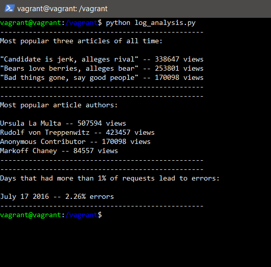

# FSND-Logs-Analysis
This is a repository for the "Logs Analysis" udacity project which is the third project required for completing the Udacity Full Stack Web Developer Nanodegree program.

The main purpose of this project is to let students understand the fundamentals of SQL by building an internal reporting tool that queries a PostgreSQL&trade; database containing over a million rows that contains a newspaper's newspaper articles, article authors, and the web server log for the newspaper site to answer three questions:

1. What are the most popular three articles of all time?  
2. Who are the most popular article authors of all time?
3. On which days did more than 1% of requests lead to errors?

The database includes three tables:
* authors table
* articles table
* log table

# Contents
* newsdata.zip - contains the compressed data from the PostgreSQL database.
* log_analysis.py - contains the code for the reporting tool.
* database-table-schema.txt - contains the schema of the PostgreSQL database.
* output_screenshot.PNG - an image of the expected output of running the reporting tool.
* Vagrantfile - contains necessary Virtual Machine configurations for the project from this this udacity [repository](https://github.com/udacity/fullstack-nanodegree-vm).

# Requirements
### Running on the pre-configured virtual machine:
Install the following:
1. [Vagrant](https://www.vagrantup.com/)
2. [Virtualbox](https://www.virtualbox.org/)

### Running on your PC or desired environment:
Install the following:
1. [Python3](https://www.python.org/downloads/)
2. [psycopg2](https://www.python.org/downloads/) python package
3. [PostgreSQL](https://www.postgresql.org/download/)

# How to run
### Running on the pre-configured virtual machine:
1. Unzip the _newsdata.zip_ file, the uncompressed file is a 120MB SQL file, keep the resulting file in the directory of the project (with Vagrantfile).

2. Open a terminal and cd to the project directory and run the command ```vagrant up```, this will build the virtual machine and may take some time.

3. After the virtual machine is set up, log into it with the command ```vagrant ssh``` and enter your password (default password is: vagrant).

4. Inside the virtual machine cd to the /vagrant/ directory ```cd /vagrant/``` and do the ```ls``` command to make sure the files in the virtual machine exist on the project directory on your actual PC.

5. To load the data to PostgreSQL, run ```psql -d news -f newsdata.sql```

6. Exit from psql by entering ```exit``` or ```Ctrl + D```

7. Run the following command:
```python log_analysis.py```
you should see an output which is the same as the expected output below.

8. Exit from the virtual machine machine by the ```exit``` command.

9. Run the ```vagrant halt``` command to stop the virtual machine.

### Running on your PC or desired environment:
1. Unzip the _newsdata.zip_ file, the uncompressed file is a 120MB SQL file, keep the resulting file in the directory of the project.

2. Run a terminal and ```cd``` to the project's directory.

3. Load the data to PostgreSQL by running ```psql -d news -f newsdata.sql``` on the terminal.

4. Run the following command:
```python log_analysis.py```
to see an output which is the same as the expected output below.

# Expected output

